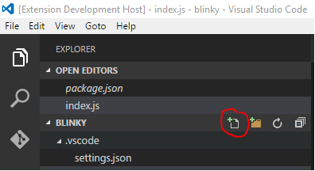

# Windows IoT Core Extension for VS Code
## About the Windows IoT Core Extension for VS Code
This extension provides an easy way to experiment with UWP Node.js apps running on Windows IoT Core.

All of the commands contributed by this extension are prefixed with "iot:" 

To see a list of commands that are contributed by this extension press F1 and then type iot.  You should see something like this

        iot: Get APPX Process Info    // get information about UWP applications running on the device
        iot: Get Device Info          // get information about the Windows IoT Core device
        iot: Get Device Name          // get the Windows IoT Core device name
        iot: Get Extension Info       // get information about this extension
        iot: Get Installed Packages   // get a list of APPX packages installed on the device
        iot: Get Process Info         // get a list of processes running on the device
        iot: Get Workspace Info       // get information about the workspace currently open in VS Code
        iot: Initialize settings.json // initialize the project settings with iot extension defaults
        iot: List Devices             // List Windows IoT Core devices on the network
        iot: Restart Device           // Restart the Windows IoT Core device.
        iot: Run Command Prompt       // Prompt for a command and then run it on the device
        iot: Run Command List         // Show a list of commands from settings.json and run the one that is picked
        iot: Run Remote Script        // Run the current workspace Node.js scripts on the Windows IoT Core device 
        iot: Set Device Name          // Set the device name using the IP Address and name provided
        iot: Start Node Script Host   // Start the Node.js script host process that works with this extension
        iot: Stop Node Script Host    // Stop the Node.js script host process that works with this extension
        iot: Upload Workspace Files   // Upload the files for this workspace but don't run the project.

### Changes
* 8/10/2016 Changed file copying to use SFTP
* 7/27/2016 Added "iot: Initialize settings.js" command
* 7/25/2016 Added "iot: List Devices" command

### Found a Bug?
Please file any issues at [https://github.com/ms-iot/vscode](https://github.com/ms-iot/vscode)

## Some Examples
### Deploying the Blinky Sample to Windows IoT Core
1. Install Node.js https://nodejs.org/ (use the LTS version if you don't know which one to choose.)
1. md c:\blinky (directory name/location isn’t important)
1. cd c:\blinky
1. npm init (accept all defaults)
1. 'code &nbsp; .'
1. F1 -> iot: Initialize settings.json
1. Enter device ip address and desired name
1. Enter the username and password to log into the device with. The defaults are "Administrator" and "p@ssw0rd".  If you prefer not to have your username and/or password in a plain text file delete these lines from the generated .json file and you will be prompted each time they are needed.
1. Verify that settings.json is correct by pressing F1 and then typing "iot: Get Device Info".  If the command succeeds you should see output similar to the following

        Get Device Info:
        Device=10.127.128.127
        ComputerName=mydevicename
        Language=en-us
        OsEdition=IoTUAP
        OsEditionId=123
        OsVersion=14393.0.armfre.rs1_release.160715-1616
        Platform=Raspberry Pi 3

1. Wire your circuit as described [here](https://developer.microsoft.com/en-us/windows/iot/samples/helloblinky)
1. Add a new file to the workspace by clicking the icon found here. Name it index.js or whatever filename you provided in npm.init.

    

1. Copy and paste code from [here](https://github.com/ms-iot/samples/blob/develop/HelloBlinkyBackground/node.js/NodeJsBlinky/server.js)

    ```   
    // Copyright (c) Microsoft. All rights reserved.

    var http = require('http');

    var uwp = require("uwp");
    uwp.projectNamespace("Windows");

    var gpioController = Windows.Devices.Gpio.GpioController.getDefault();
    var pin = gpioController.openPin(5);
    var currentValue = Windows.Devices.Gpio.GpioPinValue.high;
    pin.write(currentValue);
    pin.setDriveMode(Windows.Devices.Gpio.GpioPinDriveMode.output);
    setTimeout(flipLed, 500);


    function flipLed(){
        if (currentValue == Windows.Devices.Gpio.GpioPinValue.high) {
            currentValue = Windows.Devices.Gpio.GpioPinValue.low;
        } else {
            currentValue = Windows.Devices.Gpio.GpioPinValue.high;
        }
        pin.write(currentValue);
        setTimeout(flipLed, 500);
    }
    ```

1. F1 > "iot: Run Remote Script"
1. You should see the LED blinking

### Deploying the Hello World Sample to Windows IoT Core
1. md c:\hello (directory name/location isn’t important)
1. cd c:\hello
1. npm init (accept all defaults)
1. 'code &nbsp; .'
1. F1 -> iot: Initialize settings.json
1. Enter device ip address and desired name
1. Enter the username and password to log into the device with. The defaults are "Administrator" and "p@ssw0rd".  If you prefer not to have your username and/or password in a plain text file delete these lines from the generated .json file and you will be prompted each time they are needed.
1. Change LaunchBrowserPageNo in settings.json to LaunchBrowserPage
1. Add a new file to the workspace by clicking the icon found here. Name it index.js or whatever filename you provided in npm.init.

    

1. Copy and paste code from [here](https://developer.microsoft.com/en-us/windows/iot/samples/helloworldnode)
    ```   
        var http = require('http');
        
        http.createServer(function (req, res) {
            res.writeHead(200, { 'Content-Type': 'text/plain' });
            res.end('Hello Demo!\n');
        }).listen(1337);
    ```

1. F1 > "iot: Run Remote Script"
1. Navigate to http://${deviceip}:1337/ in a browser
